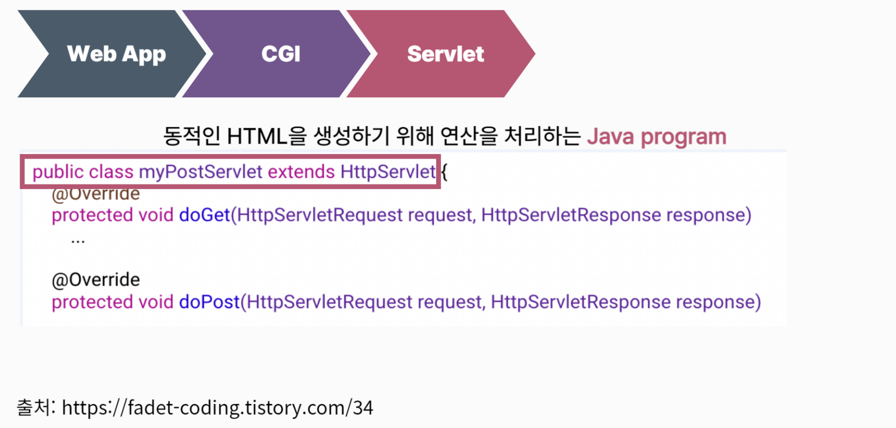
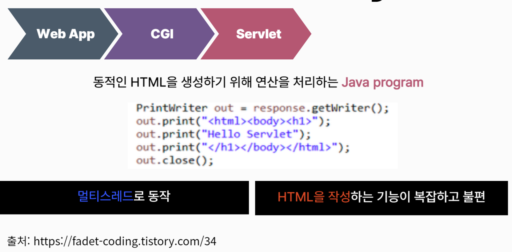
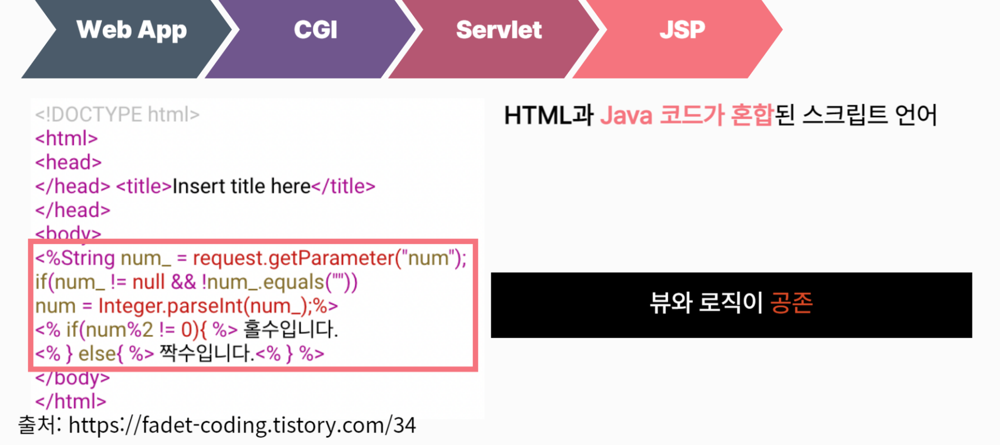
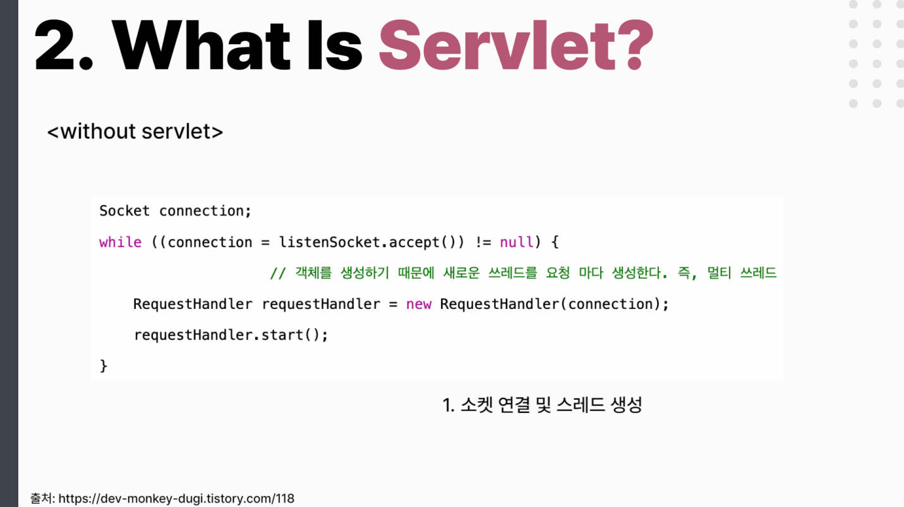
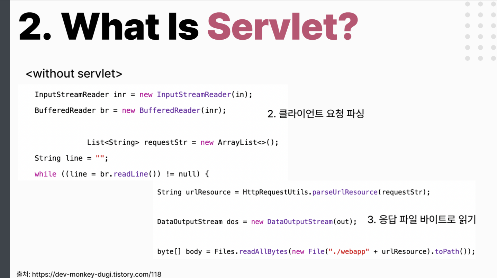
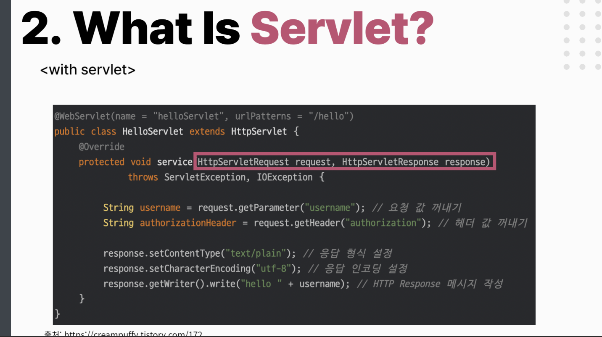

# tech-seminar-servlet

## 참고 코드

### 1. 8~10번째 슬라이드 서블릿, JSP 코드

출처: https://fadet-coding.tistory.com/34

### 2. 11번째 스프링 MVC 코드

교안 참고

### 3. 17~18번째 소켓 연결 및 파일 전송 코드

출처: https://dev-monkey-dugi.tistory.com/118

### 4. 19번째 서블릿 코드

출처: https://creampuffy.tistory.com/172
